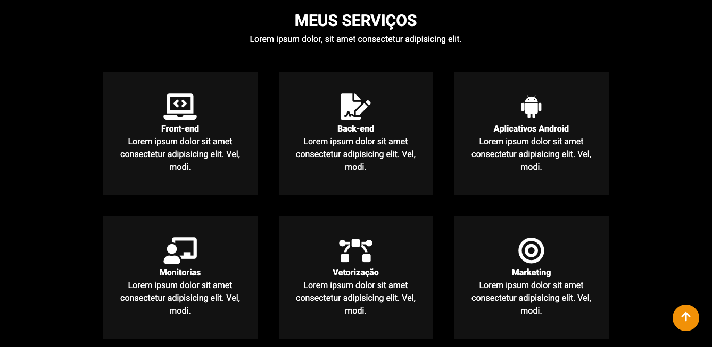

<h1 align="center"> Site de Portifólio
</h1>

<h1 align="center">
    
</h1>

<p align="center">
 <a href="#-sobre-o-projeto">Sobre</a> •
 <a href="#-layout">Layout</a> • 
 <a href="#-como-executar-o-projeto">Como executar</a> • 
 <a href="#-tecnologias">Tecnologias</a> • 
 <a href="#-autor">Autor</a> • 
</p>


## 💻 Sobre o projeto

Este projeto diz para testar meus conhecimentos na tecnologia de Flex-Box. Foi meu primeiro sem fazer consultas externas, para ver se realmente estava fixando os conteúdos do curso B7web de HTML, CSS e JavaScript.


---

## 🎨 Layout

### Tela de Adição e Listagem de Repositórios

<p align="center" style="display: flex; align-items: flex-start; justify-content: center;">
  
</p>
<p align="center" style="display: flex; align-items: flex-start; justify-content: center;">
  
</p>
<p align="center" style="display: flex; align-items: flex-start; justify-content: center;">
  
</p>
---

## 🚀 Como executar o projeto

Este projeto possui uma pasta:

1. Frontend 

### Pré-requisitos

Antes de começar, você vai precisar ter instalado em sua máquina as seguintes ferramentas:
[Git](https://git-scm.com)
Além disto é bom ter um editor para trabalhar com o código como [VSCode](https://code.visualstudio.com/)

### 🧭 Rodando a aplicação web

```bash

# Clone este repositório
$ git clone github.com/IranildoFs/gitHub_search_repository.git

# Acesse a pasta do projeto no seu terminal/cmd
$ cd gitHub_search_repository

# Vá para a pasta da aplicação Front End
$ cd segundo-projeto-react


```

---

## 🛠 Tecnologias

As seguintes ferramentas foram usadas na construção do projeto:

-   **[HTML]
-   **[CSS]


## 💪 Como contribuir para o projeto

1. Faça um **fork** do projeto.
2. Crie uma nova branch com as suas alterações: `git checkout -b my-feature`
3. Salve as alterações e crie uma mensagem de commit contando o que você fez: `git commit -m "feature: My new feature"`
4. Envie as suas alterações: `git push origin my-feature`
> Caso tenha alguma dúvida confira este [guia de como contribuir no GitHub](./CONTRIBUTING.md)

---

## 🦸 Autor

Iranildo Fialho da Silva
